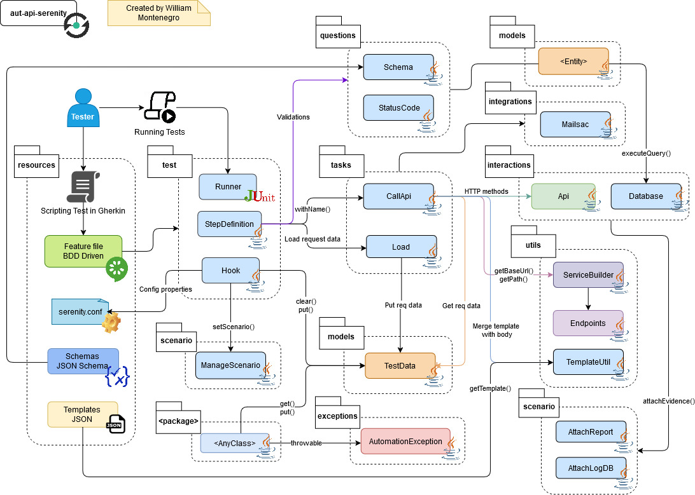

# Serenity-BDD API Automation Framework

Framework de automatización de pruebas para APIs REST utilizando Serenity BDD, implementado con el patrón Screenplay.
Este proyecto está diseñado para facilitar la escritura de pruebas legibles, mantenibles y escalables, aprovechando las capacidades de Serenity.

## 🚀 Características

- Automatización de pruebas API usando Serenity-BDD
- Estructura basada en Screenplay
- Integración con Cucumber y lenguaje Gherkin
- Manejo de logs y reportes automáticos
- Ejecución con Gradle y JUnit

## 🛠️ Tecnologías Utilizadas

- **Lenguaje de programación**: Java
- **Frameworks de automatización**:
    - [Serenity BDD](https://serenity-bdd.github.io/)
    - [Cucumber](https://cucumber.io/)
    - [JUnit](https://junit.org/)
- **Herramientas adicionales**:
    - [Gradle](https://gradle.org/)

## 📂 Arquitectura del Proyecto



## 📋 Instalación

### Clonar el Repositorio

```
git clone https://github.com/wpmontenegro/aut-api-serenity.git
cd aut-api-serenity
```

### Instalación de Dependencias

```
gradlew build -x test
```

## ▶️ Ejecución de pruebas

### Pruebas locales

1. Establezca las **Credenciales de Auht0 y Mailsac** como variables de entorno:
```
export AUTH0_CLIENT_ID=id_cliente_auth0
export AUTH0_CLIENT_SECRET=secret_cliente_auth0
export MAILSAC_API_KEY=api_key_mailsac
export REQRES_API_KEY=api_key_reqres
```
2. Ejecutar las pruebas:
```
gradlew clean test -Denvironment={ENV}
```

## 🔧 Configuración

### Parámetros

`environment` (requerido):

Especifica el ambiente donde se ejecutaran las pruebas

```
dev (para ambiente DEV)
qa (para ambiente QA)
```

### Serenity Config

Este proyecto utiliza `.serenity.conf` para gestionar configuraciones clave y facilitar la ejecución en distintos entornos (dev, qa).
El archivo se encuentran en:

```
src/test/resources/
├── serenity.conf  # Configuraciones generales para ejecución en diferentes ambientes
```

Se debe setear la url del tenant de Auth0 en la variable `auth0.url` propio dentro de este archivo

## 📊 Reportes de Pruebas

Los reportes de las ejecuciones se generan automáticamente en formato HTML y se almacenan en la carpeta `target/cucumber-reports/`.
Para visualizar un reporte:

```
open target/site/serenity/index.html
```

## 📬 Contacto

Para preguntas o sugerencias, puedes contactarme a través de:

- Correo electrónico: wmontenegro@outlook.com.pe
- LinkedIn: [**wmontenegro**](https://www.linkedin.com/in/wmontenegro)
- GitHub: [**wpmontenegro**](https://github.com/wpmontenegro)